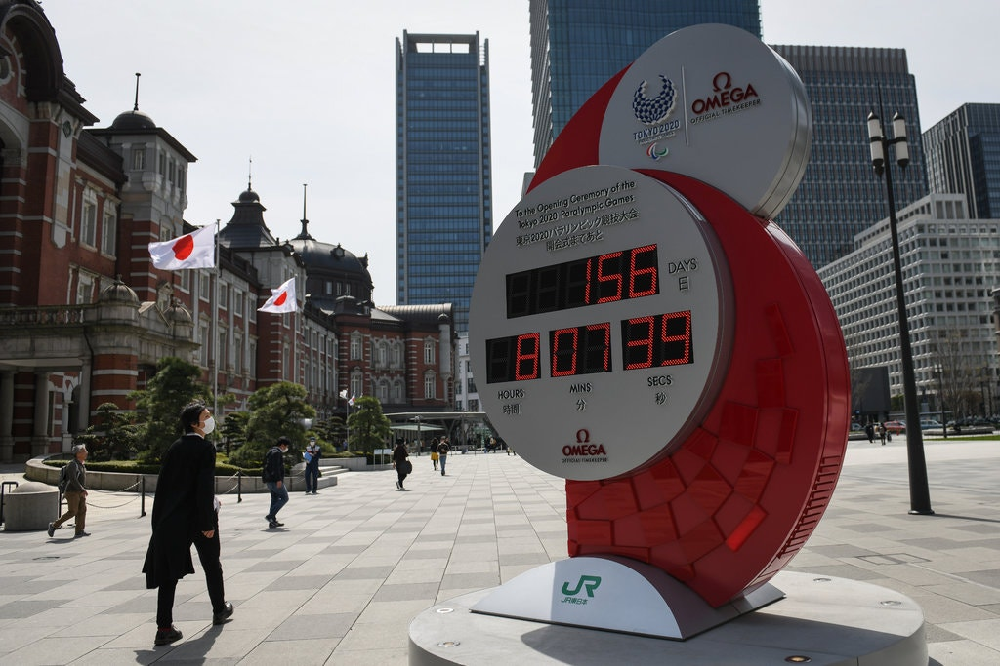

# Lesson of the Day: 'Olympians Have Another Year to Prepare for Tokyo. It's a Blessing and a Curse.'
With the Olympics postponed due to **Coronavirus**, many Olympians have another year to train and improve. The difficulty for some is that there are some problems **financially, age-wise, or health-wise** to continue to train for another year as stated in this [article](https://www.nytimes.com/2020/03/24/sports/olympics/coronavirus-olympics-athletes-reaction.html). Some people have postponed their _careers_, either academically or job-wise, in order to pursue their Olympic dreams and with the postponement of another year, many are forced into a tough position. 

> Yet when the news finally came, it was the ultimate mixed blessing: a lifeline for some and a new set of challenges that may be insurmountable because of financial, age or health issues for others.

Of note:

- The postponement was for the safety of athletes and [spectators](https://www.theguardian.com/sport/2020/mar/24/tokyo-olympics-to-be-postponed-to-2021-due-to-coronavirus-pandemic)
- Many Olympians understand the importance of fighting the [pandemic](https://www.olympic.org/news/athletes-react-to-postponement-of-tokyo-olympic-games) first
- The Olympics have never been [postponed](https://www.espn.com/olympics/story/_/id/28946033/tokyo-olympics-officially-postponed-2021) before